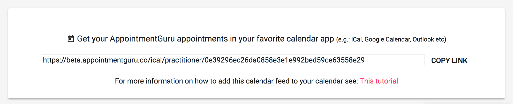

## Exporting or syncing the calendar to your phone, Google or Outlook Calendars

### Finding the Calendar feed URL

The URL for your AppointmentGuru Calendar feed will be emailed to you soon after you've signed up. Or you can get it yourself in your AppointmentGuru account.

1. Login to the [AppointmentGuru web app](http://portal.appointmentguru.co/)
2. Click on calendar, then scroll to the bottom of the page. You should see a link which looks like this:

Once you have the link, you can add it to your calendar of choice. Two things to remember:

1. it's a read-only calendar, so you won't be able to add appointments and expect it to sync back to AppointmentGuru
2. Some calendars take a while to sync (especially Google Calendar)

### Add the Calendar to your iPhone calendar app

1. On your iPhone, go to Settings > Calendar > Accounts > Add account > Other > Add subscribed account
2. Paste the Calendar URL

### Add the Calendar to your Android calendar app

1. Follow the steps to add the Calendar to your Google Calendar (below)
2. On your Android device, go to the Calendar App, or S Planner and choose the additional calendars to display

### Add the Calendar to your Google Calendar

1. In Google Calendar, go to Other Calendars > dropdown arrow > Add by URL
2. Paste the Calendar URL

### Add the Calendar to your Outlook Calendar

1. On Outlook.com go to Calendar > Import > Subscribe
2. Paste the Calendar URL

### Add the Calendar to your Mac Calendar
1. In the Calendar App, go to File > New Calendar Subscription
2. Paste the Calendar URL

### Related articles

* [Manage your appointments with the calendar](manage-your-events-with-the-calendar.html)
* [Block out time so that clients can't book when you're busy doing other stuff](block-time)
* [Managing an existing appointment](managing-existing-appointments)
