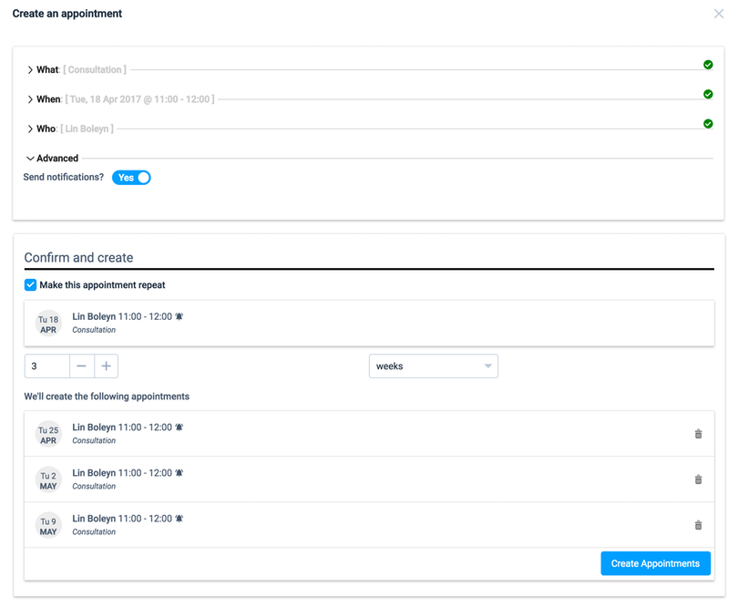

## Manage your appointments

Learn how to make and manage your appointments in the Practitioner Portal

**To create an appointment:**

* Hit the *A* key on your keyboard to open the new booking form.
* Go to the [Calendar page](http://portal.appointmentguru.co/#/calendar) and select the appointment by highlighting the hours on the calendar with your cursor

You appointment will be created and added to the calendar view.

**To create repeating appointments:**

* In the create appointment flow, click on *Make this appointment repeat*
* Choose the quantity of repeats and whether it's a daily, weekly, monthly and yearly repeat
* If one of the repeats shouldn't happen, you have the option to remove it by clicking on the trash can

**When an appointment is created:**

* An email will be sent to client with the details of their appointment
* The day before the appointment, the client will receive an SMS reminding them of their appointment

You can customize the messages that are sent from the [Settings page](http://portal.appointmentguru.co/#/settings)

**This screenshot shows the appointment creation process with repeating appointments**

### Related articles

* [Manage your appointments with the calendar](manage-your-events-with-the-calendar.html)
* [Managing an existing appointment](managing-existing-appointments)
* [Exporting and syncing the calendar to your phone, Google or Outlook Calendars](exporting-and-syncing-the-calendar)
