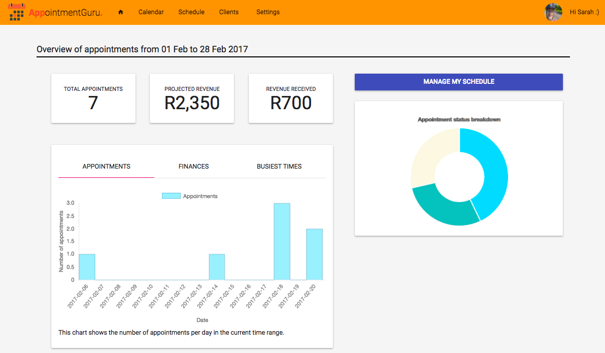

## Managing your payments

We have big plans to help you manage the payment part of your business. Right now, this is what you can do in your AppointmentGuru account:

* Add a fee amount to the appointments your Clients book with you
* Send a payment reminder
* Mark an appointment as paid
* View a dashboard showing your total income, how much has been paid and what is still outstanding

Make sure that your Client is loaded properly, with contact details included: [Add your Clients](https://appointmentguru.github.io/Tutorials/pages/add-your-clients).

### Add a fee amount to the appointments

* Following the steps on [Specify your services, locations and operating hours](https://appointmentguru.github.io/Tutorials/pages/specify-services-locations-hours), make sure an amount is added when you setup your Services.

### Send a payment reminder

1. Find the appointment (via the [Calendar page](http://portal.appointmentguru.co/#/calendar)) or the Client (via the [Client page](http://portal.appointmentguru.co/#/clients))
2. Click on the right-pointing arrow or the three vertical dots > *Send a payment request*
3. If you want to edit the default reminder message, go to the Settings page. More info on [Manage the communications that AppointmentGuru sends on your behalf](https://appointmentguru.github.io/Tutorials/pages/manage-communications)

### Mark an appointment as paid

* Following similar steps as above but instead of clicking on the right-pointing arrow, click on the credit card icon or the three vertical dots > *Mark appointment as paid*

### View the dashboard

1. Click on the home button or go to this [dashboard link](http://portal.appointmentguru.co/#/)

### Related articles

* [Specify your services, locations and operating hours](specify-services-locations-hours)
* [Manage the communications that AppointmentGuru sends on your behalf](manage-communications)
