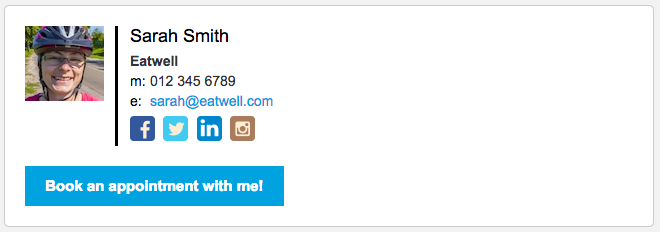

## Use your signature to let your Clients know about AppointmentGuru

The signature space on emails is a useful place to let your Clients know that they can book appointments with you. You can write your own signature or use a signature generator ([Hubspot](https://www.hubspot.com/email-signature-generator) offer one for free):

Being able to generate a signature on AppointmentGuru is [on our roadmap](http://feedback.userreport.com/811d3391-3435-426d-ad5e-5c0a27987ce9/#ideas/popular)!

### Email signatures

1. [How to edit your signature on Gmail](https://support.google.com/mail/answer/8395)
2. [How to edit your signature on Outlook](https://support.office.com/en-us/article/Create-and-add-a-signature-to-messages-8ee5d4f4-68fd-464a-a1c1-0e1c80bb27f2)

### Whatsapp

Add your booking page URL to your status on Whatsapp: *Settings* > your name > *About*

### Related articles

* [Overview of AppointmentGuru's apps and websites](overview)
* [Introduce your Clients to AppointmentGuru](introduce-your-clients)
* [Customising your booking page](customise-your-booking-page)
* [FAQ's](faqs)
